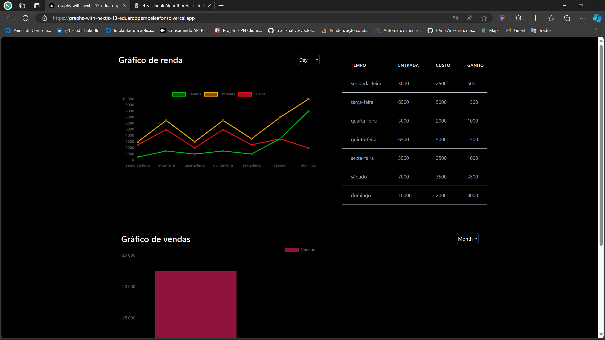
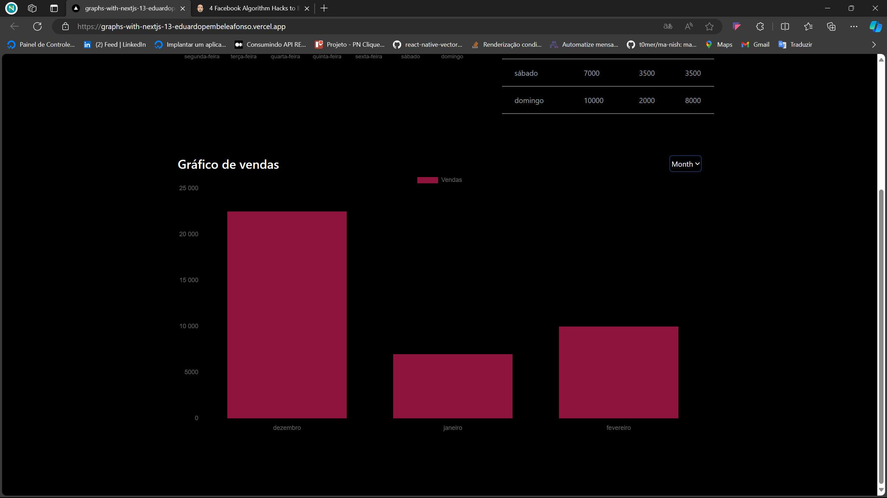

# Trabalhando com graficos no next.js 13.

Esse projecto é ponto de partida para quem esta estudar graficos no nextjs ou para quem queira implementar graficos no seu app.

## Configurações Iniciais

Antes de tudo, é preciso saber. Em **Instalação**, logo após clonar o repositório, é preciso instalar as dependencias do projecto.

# Como clonar este repositorio :
  - git clone https://github.com/EduardoPembeleAfonso/Graphs-with-nextjs


```
npm install

```


## Inicio

Primeiro, roda o servidor de desenvolvimento:

```bash
npm run dev
# or
yarn dev
# or
pnpm dev
```

Abra [http://localhost:3000](http://localhost:3000) no teu browser para veres o resultado.

Tu podes iniciar editando a pagina `src/pages/index.js`.

## Imagens do projecto :


